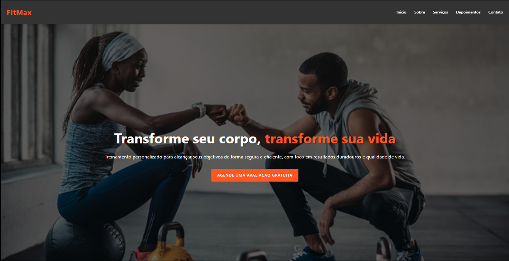

# FitMax — Landing Page

Landing page responsiva para apresentação da academia FitMax, focada em conversão e performance.

## Sobre
Aplicação web estática construída para divulgar a marca FitMax, apresentando seções como hero, benefícios, planos e contato. Projeto ideal para praticar estruturação semântica em HTML e layout responsivo com CSS.

### Imagens do projeto:

### Demo
Acesse a demo ao vivo aqui: [Link para Demo](https://fitmaxpersonaltreiner.netlify.app)

## Tecnologias
- HTML5
- CSS3 

## Como Usar
Opção 1 — Abrir diretamente
- Baixe/clones este repositório.
- Abra o arquivo index.html no navegador.

Opção 2 — VS Code (Live Server)
- Instale a extensão Live Server
- Clique em  Go Live dentro do index.html

## Estrutura
- index.html: marcação e import do CSS
- styles.css: estilos e layout responsivo

## Scripts
Este projeto não possui package.json nem scripts de npm/yarn; é um app estático e pode ser executado diretamente no navegador.

## Autor
- Nome: João Vitor - Web Dev
- GitHub: https://github.com/joaovitor-webdev
- Portfólio: https://joaovitor-webdev.netlify.app

